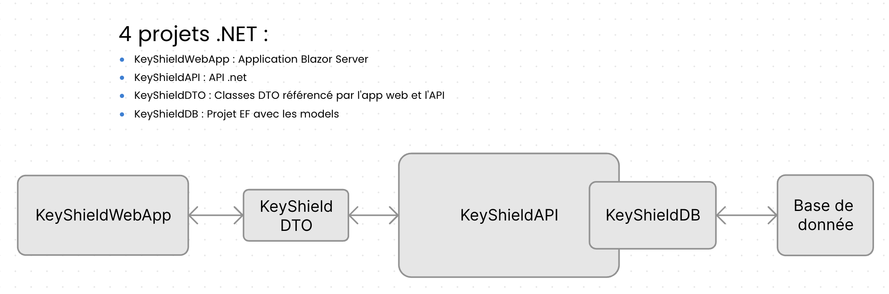
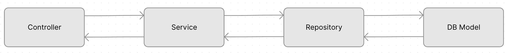
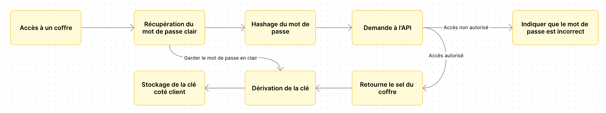
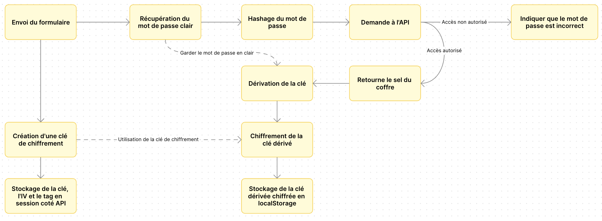
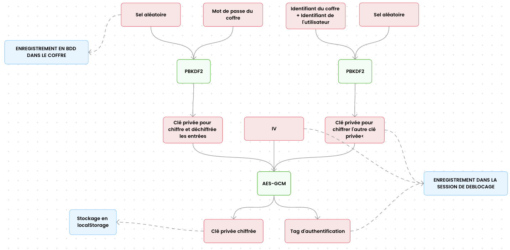

# Projet KeyShield par Julien Morin et Victor Girault
## Architecture du projet et fonctionnement

## Workflow d'un appel API

## Fonctionnement actuel du chiffrement des données

## Chiffrement qu'il aurait fallu mettre en place
Workflow :

Algorithme :


## Etapes pour lancer le projet
### 1. Changer la connection string
Changer la connection string pour permettre la connection du projet KeyShieldDB à la base de donnée SQLServer dans `KeyShieldDB/Context/KeyShieldDbContext.cs`

### 2 .Lancer le projet API
Lancer ```dotnet run``` dans le repertoir KeyShieldAPI

### 3. Lancer le projet WebApp
Lancer ```dotnet run``` dans le repertoir KeyShieldAppWeb

### 4. Se connecter à l'application web
En allant sur ```https://localhost:7082```

## Eléments rajoutés
- Générateur de mot de passe
- Calcul force de mot de passe